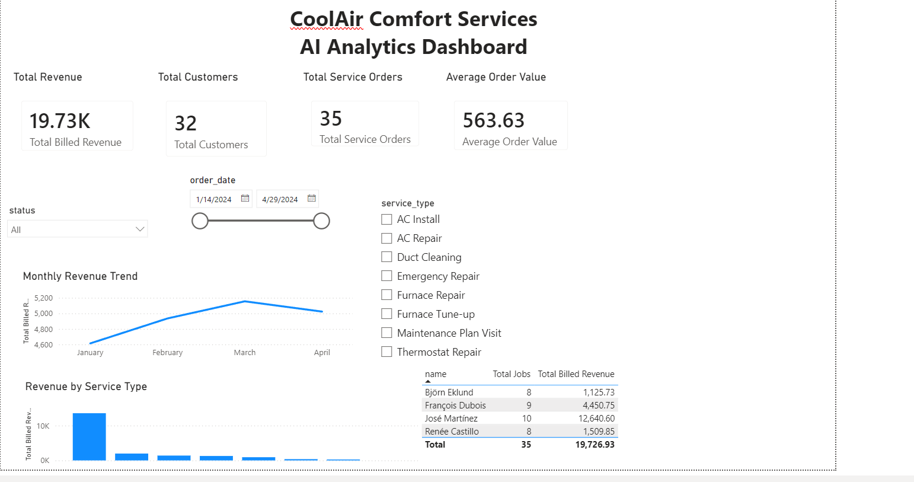

# CoolAir AI Analytics Platform

### Data Platform + Hybrid RAG/SQL Question Answering System

A proof-of-concept AI analytics platform that ingests CoolAir Comfort
Services' operational business data, audits and cleans it, loads it into
SQLite, indexes the company's policy documents with FAISS, and answers
natural-language questions through a hybrid SQL + RAG pipeline with
intelligent routing between the two.

---

## Features

- Data auditing and validation (generic, config-driven detection — not hardcoded to this dataset)
- Automated data cleaning with a documented judgment-call log
- SQLite data warehouse with corrected schema
- FAISS vector store over policy documents with version/effective-date metadata
- Hybrid SQL + RAG question answering with source attribution
- Deterministic + LLM-fallback query routing, fully logged
- Two-layer SQL safety (AST validation + read-only DB connection)
- FastAPI REST API
- Power BI dashboard

---

## Project Architecture

```
data/*.csv ──► app/audit/data_audit.py ──► app/cleaning/data_cleaning.py ──► cleaned_data/*.csv
                                                                                    │
                                                                                    ▼
                                        app/database/database_setup.py ──► database/coolair.db
                                        app/database/load_sqlite.py ──►      │
                                                                              ├──► Power BI
                                                                              │
documents/*.docx ──► app/rag/build_vector_store.py ──► database/policy_index.faiss
                                                                              │
Question ──► app/chatbot/chatbot.py ──► app/router/router.py (SQL / RAG / BOTH) ──► ┤
                                        │                                    │
                                        ├──► app/sql/sql_agent.py ────────────┤
                                        └──► app/rag/retriever.py ───────────────┘
                                                                              │
                                                                              ▼
                                                                           Answer
```

---

## Project Structure

This is the actual, tested layout — not an idealized one. Every command in
this README runs against exactly this structure.

```
CoolAir-AI-Analytics/
│
├── app/
│   ├── api.py
│   ├── chainlit_app.py
│   │
│   ├── audit/
│   │   └── data_audit.py
│   │
│   ├── cleaning/
│   │   └── data_cleaning.py
│   │
│   ├── database/
│   │   ├── database_setup.py
│   │   └── load_sqlite.py
│   │
│   ├── rag/
│   │   ├── build_vector_store.py
│   │   └── retriever.py
│   │
│   ├── router/
│   │   └── router.py
│   │
│   ├── sql/
│   │   └── sql_agent.py
│   │
│   ├── chatbot/
│   │   └── chatbot.py
│   │
│   └── utils/
│       └── config.py
│
├── data/                  ← raw CSVs
├── cleaned_data/           ← output of app/cleaning/data_cleaning.py
├── documents/              ← policy docx files
├── schema/schema.sql        ← original legacy schema (kept for reference)
├── database/                ← coolair.db, policy_chunks.json, policy_index.faiss
├── logs/                    ← audit/cleaning reports
├── powerbi/
│   ├── CoolAir_AI_Analytics_Dashboard.pbix
│   └── screenshots/dashboard_overview.png
│
├── requirements.txt
├── .env.example
└── README.md
```

All modules import as a proper Python package (`from app.utils.config import ...`,
`from app.router.router import Router`, etc.), so the project root must be
on `PYTHONPATH` when running anything under `app/` — see the run commands
below.

---

## Technology Stack

| Category        | Technologies                                                             |
| --------------- | ------------------------------------------------------------------------ |
| Language        | Python 3.11+                                                             |
| API             | FastAPI                                                                  |
| Database        | SQLite (via SQLAlchemy)                                                  |
| Vector Database | FAISS                                                                    |
| Embeddings      | Sentence Transformers (`all-MiniLM-L6-v2`, local — no API key needed) |
| LLM             | Groq (configurable via`.env` — `GROQ_API_KEY`, `LLM_MODEL`)       |
| SQL Safety      | sqlglot (AST validation) + read-only DB connection                       |
| UI              | Chainlit                                                                 |
| Dashboard       | Power BI                                                                 |
| Data Processing | Pandas                                                                   |

---

## Installation

```bash
git clone <repository-url>
cd CoolAir-AI-Analytics

python -m venv venv
source venv/bin/activate
pip install -r requirements.txt

cp .env.example .env   # fill in GROQ_API_KEY
```

---

## Running the pipeline (in order)

Run every command from the project root with `PYTHONPATH=.` set, since
everything under `app/` imports as a proper package
(`from app.utils.config import ...`).

```bash
PYTHONPATH=. python app/audit/data_audit.py         # -> logs/data_audit_report.md
PYTHONPATH=. python app/cleaning/data_cleaning.py   # -> cleaned_data/*.csv, logs/data_cleaning_report.md
PYTHONPATH=. python app/database/database_setup.py  # -> database/coolair.db
PYTHONPATH=. python app/database/load_sqlite.py     # loads + verifies row counts and FK integrity
PYTHONPATH=. python app/rag/build_vector_store.py   # -> database/policy_index.faiss (needs internet, downloads the embedding model)
PYTHONPATH=. python app/sql/sql_agent.py            # standalone safety-layer self-test — no API key needed
PYTHONPATH=. python app/router/router.py            # standalone routing self-test — no API key needed
```

> ⚠️ The FAISS index (`database/policy_index.faiss`) is required for
> document retrieval. If the index is not present after cloning the
> repository, build it using:
>
> ```bash
> PYTHONPATH=. python app/rag/build_vector_store.py
> ```

Then either:

```bash
# FastAPI
PYTHONPATH=. uvicorn app.api:app --reload

# Chainlit UI
PYTHONPATH=. chainlit run app/chainlit_app.py -w
```

Swagger UI once the API is running: `http://127.0.0.1:8000/docs`

---

## Data issues found and how they were handled

Full row-level detail is in `logs/data_audit_report.md` and
`logs/data_cleaning_report.md`, generated fresh each time the scripts run.
Summary of what was actually found in this dataset:

| Issue                                                                                                               | Where              | Decision                                                                                                                                                                                      |
| ------------------------------------------------------------------------------------------------------------------- | ------------------ | --------------------------------------------------------------------------------------------------------------------------------------------------------------------------------------------- |
| Mixed date formats (`YYYY-MM-DD`, `MM/DD/YYYY`, `DD-Mon-YYYY`)                                                | all 4 CSVs         | Normalized to ISO on load                                                                                                                                                                     |
| `-1` used as a null placeholder in `phone` (2 rows)                                                             | customers.csv      | Converted to NULL                                                                                                                                                                             |
| Likely duplicate customer — "Robert Fenwick" / "Rob Fenwick", identical phone + address                            | customers.csv      | **Not auto-merged.** Both `customer_id`s kept since `service_orders` references both; flagged for manual review rather than silently collapsing order history                       |
| 3 orphan`customer_id`s (9998, 9999) referenced by real orders                                                     | service_orders.csv | Orders kept (real revenue); placeholder customer rows inserted, tagged`is_placeholder=1` so dashboards/queries can exclude them from customer-level reporting without losing the revenue    |
| `total_amount`/`amount_due`/`amount_paid` declared `INT` in the legacy schema, but actual values have cents | schema.sql         | Changed to`NUMERIC(10,2)` in `03_database_setup.py` — an INT would have silently truncated money                                                                                         |
| 2 orders with a real dollar amount and no invoice                                                                   | invoices.csv       | Flagged as an**unexpected** gap — distinct from the expected missing invoices on $0 maintenance visits and the one cancelled order, which the audit correctly does not flag            |
| `amount_paid < amount_due` on some invoices (partial/financing payments)                                          | invoices.csv       | Not collapsed into one number. Both columns are preserved; the bot must state whether "revenue" means billed (`amount_due`) or collected (`amount_paid`) rather than picking one silently |
| Latin-1 encoded file (only 4 rows, all with accented names)                                                         | technicians.csv    | Re-saved as UTF-8                                                                                                                                                                             |

Sanity check against the loaded database: total billed revenue excluding
cancelled orders is **$19,726.93**; José Martínez is the top-performing
technician by revenue. (`04_load_database.py` prints this on every run as
part of its own self-verification.)

---

## Document versioning (RAG)

`Pricing_Addendum_v2.docx` explicitly supersedes only two sections of
`Service_Pricing_and_Policy_Handbook_v1.docx`:

- **Section 3.2 (parts warranty)** — extended 12 → 18 months, but only for
  compressor/condenser parts, and only for installs on/after **June 1, 2025**.
- **Section 4.1 (emergency diagnostic fee)** — increased **$89.00 → $129.00**,
  effective **June 1, 2025**. The standard weekday fee and the 1.5x
  after-hours labor surcharge are explicitly unchanged.

Every service order in this dataset predates June 1, 2025 — so a question
about a specific historical order must still resolve to the v1 rate even
though v2 is the current policy. Each indexed chunk carries `version`,
`priority`, and `effective_date` metadata (see `app/rag/build_vector_store.py`)
so retrieval can apply the correct source instead of assuming "the newer
document always wins."

---

## SQL agent safety

Two independent layers, both required — see `app/sql/sql_agent.py`:

1. **AST-level validation** (`sqlglot`) walks the *entire* parse tree, not
   just the top-level statement type. This matters: a destructive statement
   smuggled inside a CTE (`WITH x AS (DELETE FROM customers RETURNING *) SELECT * FROM x`) still parses with an outer `Select` node — a
   top-level-only check misses it. Validating LLM-generated SQL before
   execution this way, rather than a keyword regex, is what catches that case.
2. **Read-only SQLite connection** (`file:...?mode=ro`) at the OS level, so
   even a query that somehow bypassed the parser is physically unable to write.

Run `PYTHONPATH=. python app/sql/sql_agent.py` directly — it self-tests both layers
against 8 cases, including the CTE example above, with no API key required.

---

## Router

Deterministic keyword+weight scoring (`app/router/router.py`) decides
SQL vs. RAG vs. BOTH for unambiguous questions with no LLM call. The LLM
classifier fallback fires only when there's a genuine competing signal —
both a SQL-side term and a doc-side term present and close in weight — or
when neither side matched anything. A zero on either side is never treated
as ambiguous, regardless of the other side's magnitude. Every decision is
logged to `logs/routing_log.jsonl` with the scores and reasoning.

Run `PYTHONPATH=. python app/router/router.py` for the self-test (also runs with no API key).

---

## Ambiguous ranking questions

For questions like "top customers" that don't specify a metric, the bot
states its assumption in the response instead of silently picking one
(`app/chatbot/chatbot.py`, `_flag_ambiguous_ranking`) — per the assignment's
requirement not to guess quietly on interpretation-dependent questions.

---

## API Endpoints

### Health Check

```
GET /health
```

### Ask (full pipeline)

```
POST /ask
{"question": "What is the emergency diagnostic fee?"}
```

Example response (once an LLM key is configured):

```json
{
    "route": "RAG",
    "answer": "The emergency diagnostic fee is $129.00, effective June 1, 2025.",
    "sources": ["Pricing_Addendum_v2.docx (effective 2025-06-01)"]
}
```

Without a configured key, `/ask` returns a clean `501` naming exactly
which stub needs the key, rather than a stack trace.

---

## Sample Questions

Useful during a live demo — copy directly rather than improvising on the spot.

### SQL

- Which technician generated the highest revenue?
- How many service orders were cancelled?
- Show customers with outstanding invoices.

### RAG

- What is the emergency diagnostic fee?
- What is the warranty period for compressor parts?
- What does the pricing policy say about emergency service?

### Hybrid (SQL + RAG)

- Customer 1010 had an emergency repair (order 5008) — which pricing policy applies to that order's diagnostic fee?
- Compare billed revenue (`amount_due`) with collected revenue (`amount_paid`) for orders under the current warranty policy.

---

## Power BI Dashboard

Connects to `database/coolair.db` (via the SQLite ODBC driver, or by
loading `cleaned_data/*.csv` directly if the driver isn't available).
Minimum visuals: revenue over time, revenue/job count by service type,
and technician performance.



The `.pbix` file itself is in `powerbi/CoolAir_AI_Analytics_Dashboard.pbix`.

---

## What still needs your API key

- `natural_language_to_sql()` in `app/sql/sql_agent.py`
- `generate_answer()`'s LLM call in `app/rag/retriever.py`
- `llm_classify_structured()` in `app/router/router.py`

Each raises a clear `NotImplementedError` with a commented example call,
rather than failing silently, until a key is set in `.env`.

---

## Known limitations

- `app/rag/build_vector_store.py` needs internet access on first run to download
  the embedding model.
- The Power BI dashboard must be built on a machine with the SQLite ODBC
  driver (or via CSV export) — not producible in a headless environment.
- No authentication on the FastAPI endpoints — acceptable for a local POC,
  not beyond it.

---

## Author

**Sugali Tharun Kumar**
